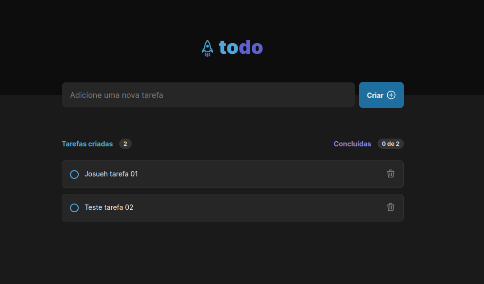

# Todo-List

Uma aplicação de gerenciamento de tarefas desenvolvida durante o primeiro desafio do Ignite, bootcamp da Rocketseat, especificamente, da Trilha de ReactJS. O projeto foi desenvolvido a partir de um template previamente disponibilizado.

O foco do projeto é ampliar, na prática, a compreensão dos Conceitos Fundamentais do ReactJS. O objetivo é uma pequena aplicação de atividades a fazer, para treinar um pouco mais sobre manipulação do estado no React. Para isso, foi desenvolvido (da minha parte) toda a lógica para:

Adicionar uma nova tarefa;
Remover uma tarefa;
Marcar e desmarcar uma tarefa como concluída.

## Funcionamento da Aplicação

Imagem demonstrativa.

## Recursos Extras Adicionados

### 1. Responsividade

A fim de praticar alguns conceitos adicionais do Desenvolvimento Front-End, adicionei também responsividade à aplicação.
